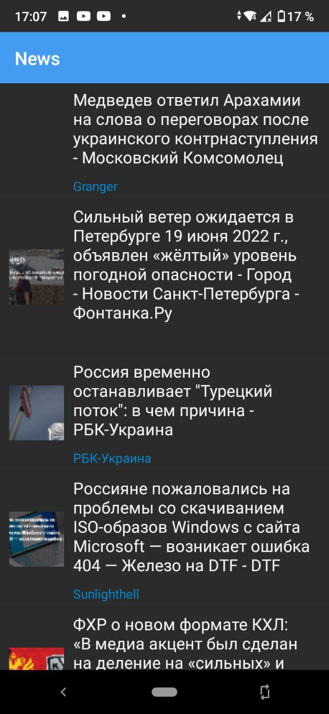
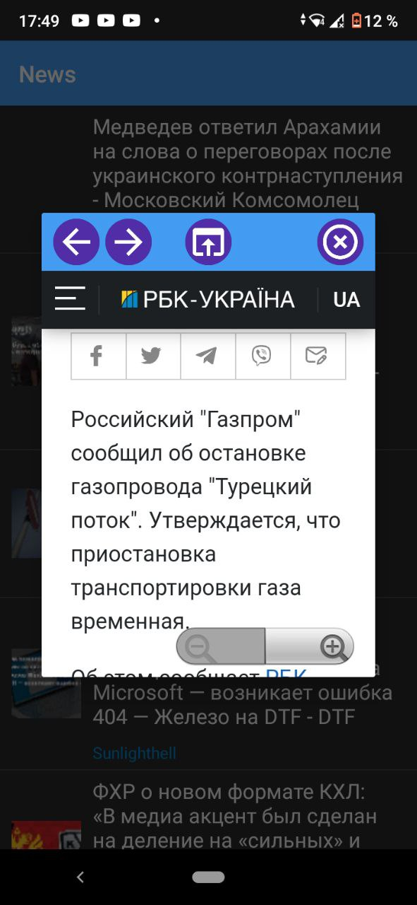

# Простое новостное приложение

  

## Описание

Это простое новостное приложение для Android, использующее Google News API для получения главных новостей. Этот проект портфолио был создан, чтобы показать, как легко работать с Kotlin и Google Api.

В приложении вы можете использовать быстрый просмотр для быстрого открытия URL-адреса в диалоговом веб-просмотре. Затем вы можете открыть URL-адрес в обычном браузере, если вам это нужно

  

  

### Зависимости

* [Google news Api](https://newsapi.org/s/google-news-api) 
for get news

* [Picasso Librarry](https://github.com/square/picasso) 
for easy set img from url

* [Okhttp3](https://github.com/square/okhttp/tree/master/okhttp/src/main/java/okhttp3) 

### Апк для теста
* [Download APK](https://github.com/infinitum1984/SimpleNewsAndroidApp/blob/master/app/src/main/assets/Simple%20News%20App.apk) 

## Автор

Сделал - Подворный В.Т. КИУКИ-19-7

## Апи

* [Google News API](https://newsapi.org/s/google-news-api)

